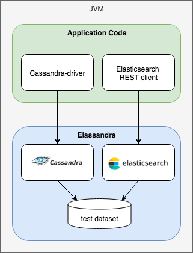

git statu# ElassandraUnit

**ElassandraUnit** is a fork form [CassandraUnit](https://github.com/jsevellec/cassandra-unit) modified for [Elassandra](http://www.elassandra.io).

**ElassandraUnit** helps you writing isolated JUnit tests in a Test Driven Development style with an embedded [Elassandra](http://www.elassandra.io) instance.

 

* Start an embedded Elassandra (including both Cassandra and Elasticsearch).
* Create structure (keyspace and Column Families) and load data from an XML, JSON or YAML DataSet.
* Execute a CQL script.
* Query Cassandra through the [Cassandra driver](https://github.com/datastax/java-driver) 
* Query Elasticsearch through the [Elasticsearch REST API](https://www.elastic.co/guide/en/elasticsearch/client/java-rest/6.5/java-rest-high.html).

## Quick start

Add the following dependencies:

```xml
    <dependency>
        <groupId>com.strapdata.elassandraunit</groupId>
        <artifactId>elassandra-unit-spring</artifactId>
        <version>${elassandra-unit.version}</version>
        <scope>test</scope>
        <exclusions>
            <exclusion>
                <groupId>com.strapdata.elassandraunit</groupId>
                <artifactId>elassandra-unit</artifactId>
            </exclusion>
        </exclusions>
    </dependency>
    <dependency>
        <groupId>com.strapdata.elassandraunit</groupId>
        <artifactId>elassandra-unit</artifactId>
        <classifier>shaded</classifier>
        <exclusions>
            <exclusion>
                <artifactId>httpclient</artifactId>
                <groupId>org.apache.httpcomponents</groupId>
            </exclusion>
            <exclusion>
                <artifactId>httpcore</artifactId>
                <groupId>org.apache.httpcomponents</groupId>
            </exclusion>
        </exclusions>
        <version>${elassandra-unit.version}</version>
        <scope>test</scope>
    </dependency>
```

Add the Elasticsearch REST high level client with the same version as the one embedded in elassandra.

```xml
    <dependency>
      <groupId>org.elasticsearch.client</groupId>
      <artifactId>elasticsearch-rest-high-level-client</artifactId>
      <version>6.2.3</version>
    </dependency>
```

To handle Elasticsearch search requests over CQL, set the system property **cassandra.custom_query_handler_class** to **org.elassandra.index.ElasticQueryHandler**:

```xml
    ...
    <build>
        <plugin>
            <groupId>org.apache.maven.plugins</groupId>
            <artifactId>maven-surefire-plugin</artifactId>
            <version>3.0.0-M3</version>
            <configuration>
                <systemPropertyVariables>
                    <cassandra.custom_query_handler_class>org.elassandra.index.ElasticQueryHandler</cassandra.custom_query_handler_class>
                </systemPropertyVariables>
            </configuration>
            </plugin>
        </plugins>
    </build>
```

Create a JUnit test class :

```java
public class SimpleTest {

    static final String KEYSPACE = "ks";

    @ClassRule
    public static CassandraCQLUnit cassandraCQLUnit =
        new CassandraCQLUnit(new SimpleCQLDataSet(
            "CREATE TABLE users (email text PRIMARY KEY, firstname text, lastname text, es_query text, es_options text);", KEYSPACE));

    private static Mapper<User> userMapper;
    private static RestHighLevelClient client;

    @Before
    public void setup() throws IOException {
        userMapper = new MappingManager(cassandraCQLUnit.session).mapper(User.class);
        client = new RestHighLevelClient(RestClient.builder(new HttpHost("localhost", 9200, "http")));

        // create an elasticsearch index on table users
        CreateIndexRequest request = new CreateIndexRequest("users");
        request.mapping("users", XContentFactory.jsonBuilder()
            .startObject()
                .startObject("users")
                    .field("discover", ".*")
                .endObject()
            .endObject());
        request.settings(Settings.builder()
            .put("keyspace", KEYSPACE)                          // map index users to our keyspace.
            .put("index.synchronous_refresh",true)// synchronous elasticsearch refresh
            .build());
        CreateIndexResponse createIndexResponse = client.indices().create(request);
    }

    @Test
    public void testMapper() throws Exception {
        User user1 = new User().withEmail("user1@test.com").withFirstname("Bob").withLastname("Smith");
        User user2 = new User().withEmail("user2@test.com").withFirstname("Alice").withLastname("Smith");
        User user3 = new User().withEmail("user3@test.com").withFirstname("Paul").withLastname("Dupont");
        userMapper.save(user1);
        userMapper.save(user2);
        userMapper.save(user3);

        User user = userMapper.get("user1@test.com");
        assertThat(user, is(user1));

        // Elasticsearch search through the REST API
        SearchSourceBuilder sourceBuilder = new SearchSourceBuilder().query(QueryBuilders.termQuery("lastname", "Smith"));
        SearchRequest searchRequest = new SearchRequest().indices("users").source(sourceBuilder);
        SearchResponse searchResponse = client.search(searchRequest);
        assertThat(searchResponse.getHits().totalHits, is(2L));

        // Elasticsearch search through CQL
        String esQuery = new SearchSourceBuilder().query(QueryBuilders.termQuery("lastname", "Smith")).toString(ToXContent.EMPTY_PARAMS);
        ResultSet results = cassandraCQLUnit.session.execute(
            "SELECT * FROM users WHERE es_options = ? AND es_query = ? ALLOW FILTERING", "indices=users", esQuery);
        Result<User> users = userMapper.map(results);
        assertThat(users.all().size(), is(2));
    }
}
```

## Resources

* [cassandra unit wiki](https://github.com/jsevellec/cassandra-unit/wiki)
* [cassandra-unit-examples](https://github.com/jsevellec/cassandra-unit-examples)
* [elassandra-unit-examples](https://github.com/strapdata/elassandra-unit-examples)

## Support

 * Community support available via [elassandra google groups](https://groups.google.com/forum/#!forum/elassandra).
 * Post feature requests and bugs on https://github.com/strapdata/elassandra-unit/issues
 * Commercial support is available through [Strapdata](http://www.strapdata.com/).

## License

This project is licensed under [LGPL V3.0](http://www.gnu.org/licenses/lgpl-3.0-standalone.html)

## Acknowledgments

* [CassandraUnit](https://github.com/jsevellec/cassandra-unit) is developped by Jérémy Sevellec
* Elasticsearch and Kibana are trademarks of Elasticsearch BV, registered in the U.S. and in other countries.
* Apache Cassandra, Apache Lucene, Apache, Lucene and Cassandra are trademarks of the Apache Software Foundation.
* Elassandra is a trademark of Strapdata SAS, registered in the U.S. and in other countries.

